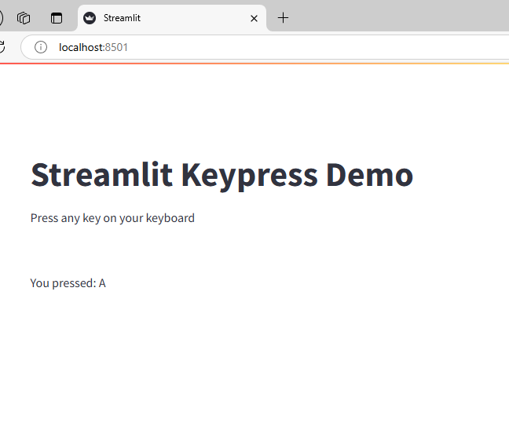

# Streamlit Keypress

A Streamlit component that captures keyboard events in your Streamlit app.

## Installation

```bash
pip install streamlit-keypress
```

## Usage

```python
import streamlit as st
from streamlit_keypress import key_press_events

st.title("Keyboard Event Listener")

key = key_press_events()
if key:
    st.write(f"You pressed: {key}")
```




## Features

- Captures keyboard events throughout your Streamlit app
- Returns the key that was pressed
- Simple and lightweight

## Contributing

Contributions are welcome! Please feel free to submit a Pull Request.

## License

This project is licensed under the MIT License - see the LICENSE file for details.